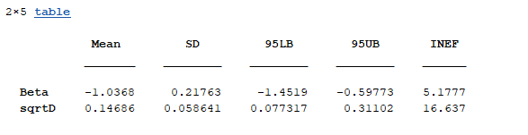
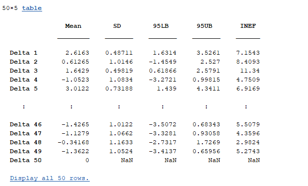
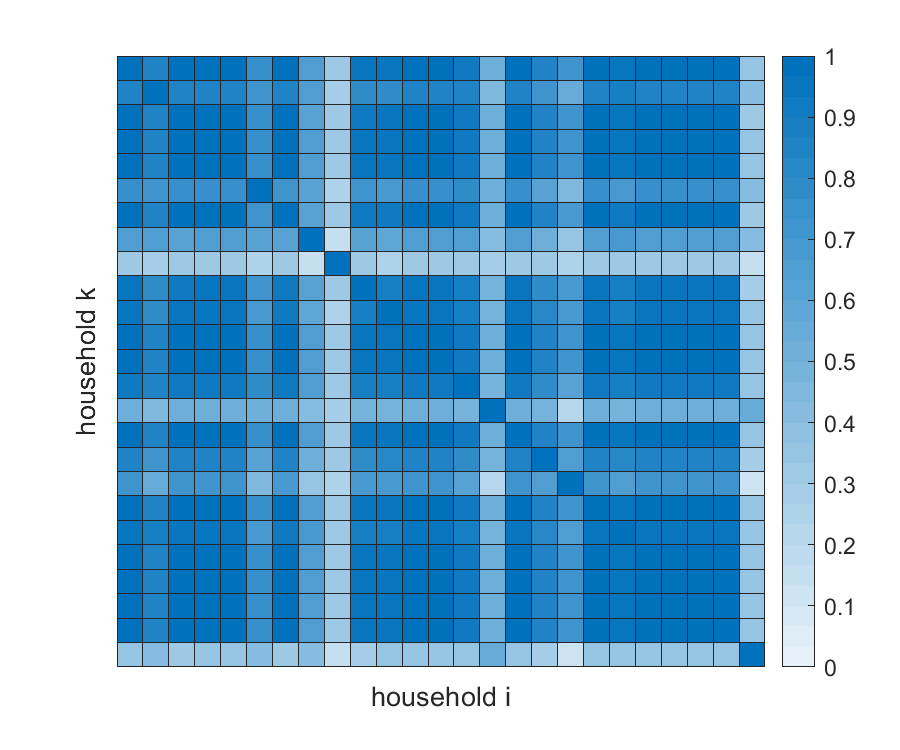
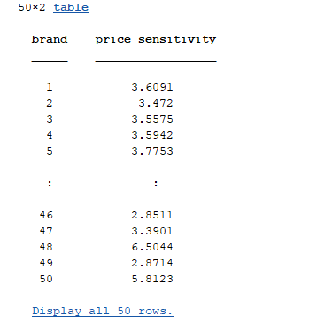

# Getting Started with the ScalableCS Package

[comment]: <> (### Kenichi Shimizu)

[comment]: <> (### 2025-02-06)


# Table of contents
1. [Introduction](#introduction)
2. [The model](#model)
3. [Data Structure](#data)
4. [Data Structure](#demo)


This vignette discusses the basics of the scalable estimation of consideration set models the **ScalableCS** package in Matlab. The background article for it is ["Scalable Estimation of Multinomial Response Models with Random Consideration Sets
"](https://anonymous.4open.science/r/jasa_reproducibility-22DF/manuscript/manuscript.pdf).

* The **ScalableCS** package allows for estimation of multinomial logit model with latent consideration sets.
* The **ScalableCS** package is scalable with respect to the number of alternatives while maintaining flexibility of consideration dependence across alternatives.
* To do so, the **ScalableCS** package fits **infinite mixture of independent consideration models**. 
* The **ScalableCS** package can deliver (1) estimated logit parameters, (2) estimated consideration sets, and (3) demand sensitivity with respect to covariates. 

## Dimensions
- $J$ = the number of alternatives (brands, products, etc).
- $n$ = the number of units (consumers, households, etc).
- Each unit is observed for $T_i$ periods. $nT$ denotes the summation $\sum_i T_i$.
- $dx$ = the number of covariates with fixed effects/slopes.
- $dz$ = the number of covariates with random effects/slopes.

## The model <a name="paragraph1"></model>
The hierarchical model has two main stages: (1) the response model conditional on latent consideration sets and (2) the model for consideration sets.
  
### 1. The conditional response model given consideration sets 

* This is the canonical multinomial logit model with $J$ alternatives.
* Let $y_{ijt}$ be an indicator that equals one if the response of unit $i$ at time $t$ is $j$.
* For each unit $i$, its latent consideration set $\mathcal{C_i}$ is a subset of the collection $\\{ 1,...,J \\}$.
* The response probability given that $\mathcal{C_i}=c$ is 

$$
 Pr(y_{ijt}=1 \vert \mathcal{C_i}= c )=\frac{V_{ijt}}{\sum_{\ell \in c} V_{i \ell t}},
$$

where

$$
 V_{ijt}=\delta_j+\beta x_{ijt}+b_i z_{ijt},
$$

where 
* $\beta$ is a vector of fixed effects/slopes,
* $b_i\sim N(0, D)$ is a vector of random effects,
*  $x_{ijt}$ and $z_{ijt}$ are observed covariates,
*  $\delta_j$ is the alternative fixed effect (by default, $\delta_J$ is normalized to zero).
* Inclusion of $\delta_j$ and $b_i$ is optional.  
* Note that the time $t$ is specific to the units. Hence, the first period for unit 1 might be different from the first period for unit 2 in the real time. 

### 2. Distribution of consideration sets

* The consideration sets are random objects and follow an unknown distribution $\pi$.
* Note that its support has $2^{J}-1$ points, which exponentially increases in $J$. A direct estimation based on simulated MLE or MCMC faces a curse of dimensionality. 

#### Infinite mixture of independent consideration models  
*  Our approach achieves a scalable estimation while maintaining flexible dependence of consideration across alternatives through **infinite mixture of independent consideration models**.
* Practically, this amounts to grouping the units into latent groups. In each group, consideration or attention to different products are independent and the <em>attention probabilities</em> are shared among the units.
* Marginally over the latent groups or the mixture components, it is ensured that consideration dependence is flexible. 
*  See the paper for full detail.

  
## Data structure <a name="subparagraph1"></data>
* The package requires a certain structure of the dataset. Although it allows a cross-sectional data, a typical dataset is longitudinal(panel).
* The dataset should contain two matrices: the response matrix $Y$ and the covariate matrix $X$.

### The response matrix   
* The matrix $Y$ contains information on the responses $y_{ijt}$.
* It has $nT$ rows: $T_i$ rows for each unit $i=1,...,n$.
* Let $J=3$. Suppose that the first unit is observed for three periods and the second unit is observed for two periods.
*  The following shows an example of the matrix $Y$:

Unit | Time | Response 
--- | --- | --- 
 1 | 1 | 2
 1 | 2 | 1
 1 | 3 | 2
 2 | 1 | 2
 2 | 2 | 3
: | : | : 
* In this table, we see that unit 1's responses over time were 2, 1, and 2; those for unit 2 were 2 and 3.

  
### The covariate matrix   
* The matrix $X$ contains information on covariates $x_{ijt}$.
* It has $JnT$ rows: $JT_i$ rows for each unit $i=1,...,n$.
* For example, it may include price, display, and feature ($dx=3$).
* The following shows an example of the matrix $X$:

Unit | Time | Alternative | price | display | feature
--- | --- | --- | ---  | --- | --- 
1 | 1 | 1 | 2.2 | 0   | 0 | 
1 | 1 | 2 | 3.1 | 0   | 0 |  
1 | 1 | 3 | 1.5 | 1   | 1 |  
1 | 2 | 1 | 2.3 | 1   | 0 |  
1 | 2 | 2 | 3.0 | 0   | 1 | 
1 | 2 | 3 | 1.6 | 0   | 0 | 
1 | 3 | 1 | 2.3 | 0   | 0 | 
1 | 3 | 2 | 3.3 | 1   | 0 | 
1 | 3 | 3 | 1.4 | 0   | 0 | 
2 | 1 | 1 | 2.5 | 0   | 0 | 
2 | 1 | 2 | 3.1 | 0   | 0 |  
2 | 1 | 3 | 1.5 | 1   | 1 |  
2 | 2 | 1 | 2.6 | 1   | 0 |  
2 | 2 | 2 | 3.0 | 0   | 1 | 
2 | 2 | 3 | 1.6 | 0   | 0 | 
: | : | : | :  | :  | :  


# Demonstration: An analysis on cereal purchase data <a name="subparagraph1"></demo>
* This is a synthetic data of smaller scale of the actual data set considered in the paper.
* It is a panel data consisting of $n=25$ households' purchases from $J=50$ cereal brands (in the empirical application of the paper, we use a larger data set with $n=1880, J=101$).
* In each period, household's purchased brand is recorded.
* On average, there are 13 periods of observation for each household. 
* The data also contains information on price of the brands at each of the purchasing occasions ($dx=1$) for which a random effect is considered ($dz=1$).

* Let's run MCMC (Markov Chain Monte Carlo) for 2000 iterations.

## Implementation

```
YData = readtable('myDataDemonstration/YData_DEMO.txt');
XData = readtable('myDataDemonstration/XData_DEMO.txt');
[meanPara,sdPara,lbPara,ubPara,inefPara,estC,SimilarityMatrix,aggOwnElas]=scalableCS(YData,XData,2000,"MNL_RC");
```

## Parameter estimates
* As expected, the slope on price is negative and its 95% credible interval does not include zero.
* Also, we see significant evidence of dispersion in the random coefficients.
  


* The estimated fixed-effects for 50 brands are presented below.
* Note that the last one is normalized to zero for identification purpose. 



## Latent grouping structure 
* Our **infinite mixture of independent consideration models** approach groups the units into latent clusters according to their <em>attention probabilities</em>. 
* The code produces a $n$ by $n$ matrix of posterior probabilities that a given pair of units (households) are in a same latent group that shares consideration probabilities.
* Darker the color is, higher the probability is. 


## Price sensitivity
* The code provides sensitivity measure of demand with respect to a covariate, in this case, price.
* It is an estimated % decrease in demand of brand $j$ when its own price increases by 1 %.
* This is the absolute value of price elasticity of demand.
* Demand in this market is elastic, meaning that for all brands, the sensitivity is greater than 1 %.
 



  


